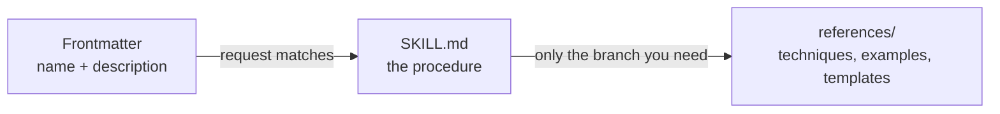

# laiqiands-skills

[](https://github.com/LaiqianDS/laiqiands-skills/actions/workflows/validate.yml)
[](.claude-plugin/plugin.json)
[](LICENSE)

Skills for [Claude](https://claude.ai) that make it interview, diagnose and write a document, instead of answering with a generic list.
Each skill teaches Claude one repeatable workflow.

## Skills

| Skill | What it does | What you get |
|-------|--------------|--------------|
| [**teach-me**](./skills/teach-me/) | Teaches a subject one to one across sessions. Probes what you already hold, maps the subject as a dependency graph, then teaches one node at a time and makes you prove it stuck. | A course folder: `COURSE.md`, `MAP.md` and one lesson file per class |
| [**design-with-me**](./skills/design-with-me/) | Guides one design step by step across Claude Code and Claude Design: brief, reference design system, exploration, build, polish and record. | The interface in your stack, and a `DESIGN.md` read from what was built |
| [**atomic-habits**](./skills/atomic-habits/) | Designs, diagnoses or repairs a habit with the Atomic Habits framework. Finds the broken stage of the habit loop before it prescribes anything. | `habit-plan-<name>.md`, a plan you bring back to review |
| [**seo-review**](./skills/seo-review/) | Reviews a website against 23 SEO checks, from crawling and indexing to content and backlinks. Quotes evidence for each result, then fixes the failures you accept. | `SEO-REVIEW.md`, each check with its status, evidence and fix |
| [**cold-email**](./skills/cold-email/) | Writes cold emails, DMs and follow-up sequences in a five-line structure, framed around the recipient. | A message ready to send, plus a follow-up cadence |

Each skill folder has a README with example prompts and design notes.

## How a skill loads

Claude reads a skill in stages, so a skill costs almost nothing until it is needed.



Every skill here keeps the procedure in `SKILL.md` and moves anything that only one branch needs into `references/`.

## Install

### Claude Code

This repository is a Claude Code marketplace.
The plugin installs every skill, and `/plugin update` keeps them current.

```bash
claude plugin marketplace add LaiqianDS/laiqiands-skills
claude plugin install laiqiands-skills@laiqiands
```

To install one skill only, symlink it into `~/.claude/skills/`:

```bash
git clone https://github.com/LaiqianDS/laiqiands-skills.git
ln -s "$PWD/laiqiands-skills/skills/cold-email" ~/.claude/skills/cold-email
```

### Claude.ai

1. Zip the skill folder, not the files inside it: `cd skills && zip -r cold-email.zip cold-email`.
2. Upload the zip in **[Customize > Skills](https://claude.ai/customize/skills)** and enable it.
3. For `teach-me` and `atomic-habits`, enable code execution in **Settings > Capabilities**. It lets Claude read the reference files.

### Claude API

Upload a skill folder and attach it to a request.
See the [Skills guide](https://platform.claude.com/docs/en/build-with-claude/skills-guide).

## Contributing

Open an issue for a bug or an improvement.
For a new skill, open an issue first to agree the scope, then follow [CONTRIBUTING.md](CONTRIBUTING.md).

## License

[MIT](LICENSE)
