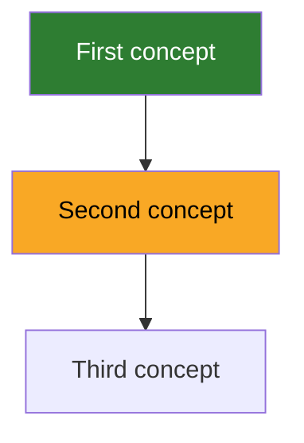
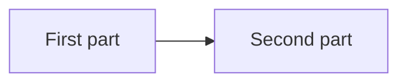

# Teach Me

Teach one to one: never teach what the learner already holds, and explain the way they asked.
Probe until you can name where they stop, draw the map, then teach one node and prove it stuck.
Each phase leaves a file, and an explanation that lives only in the conversation is not the job.

## The workspace

| Phase | Artifact | Changes |
|---|---|---|
| 1. Triage | `COURSE.md` | Only when the goal moves |
| 2. Map | `MAP.md` | Every session |
| 3. Teach | `lessons/000N-<slug>.md` | Append only |
| 3. Teach | `lessons/000N-<slug>.html` | Append only, and only when the node earns a page |

Work in the current directory when it holds a `COURSE.md`, otherwise in a new `<subject-slug>/`.

File names, directory names, headings and Mermaid keywords are always English, exactly as written here, so every course has the same shape.
Everything the learner reads is in their language: explanations, diagram text, evidence, questions, verdicts and the words on a page, with `<html lang>` to match.
Node labels and terms of art use the word the learner will meet in the field, which is usually English.

Never put angle brackets in Mermaid text: Mermaid reads them as HTML tags and the text vanishes.

## Procedure

Read `references/example-course.md` once per session, before you draw a map or write a lesson.

### 1. Triage

Ask for the goal in at most two questions: what they want to be able to do, and how they want it explained.
Push "understand X" until it names something they will be able to do.

Then probe with **eight to twelve questions, never more**.
Ask one question on each of three or four anchor concepts spread across the subject, then narrow into the branch that came back ambiguous.
Knowledge is a graph, not a ladder: a learner can hold an advanced branch and miss a basic one.
Every probe makes the learner produce something.
A definition measures vocabulary, and a self-rated level is a hint, never evidence.

Done when you can name the frontier, backed by something the learner produced, and `COURSE.md` is written.
The triage result goes into `MAP.md` as node state, never into `COURSE.md`.

### 2. Map

Draw the graph in `MAP.md`.
Nodes are the concepts the goal in `COURSE.md` needs, **twenty five at most**. More is a second course.
An edge means the parent must be held before the child makes sense, so order by dependency, never by a book's chapters.
Mark every node the triage reached and leave the rest bare.
Show the map to the learner and let them correct it.

Done when every probed node carries a state and the learner has seen the map.

### 3. Teach

Teach **one node per lesson**, and only a node whose parents are solid.
Turn the difficulty **down** while you teach and **up** while you test.

1. Teach the node as a class, under **Lessons**, in the conversation and in `lessons/000N-<slug>.md` with the same depth.
2. Build a page only when the node earns one, under **Pages**.
3. Test it, under **Proving it stuck**, and write the question, the answer and the result into the lesson.
4. Update `MAP.md`.

Done when the node's state in `MAP.md` is backed by something the learner produced, and the lesson file teaches the node to a reader who never saw the conversation.

## Lessons

A lesson is a class, not a note.
A learner who opens it a month from now, with the conversation gone, must be able to learn the node again from the file alone.

The lesson template is the default shape, not a form.
Add a section the node needs, such as a second example or a comparison, and drop one that has nothing true to say.
`## Sources`, `## Check` and `## Result` are always there.
The teaching sections follow the order `COURSE.md` asks for.

- **Examples are real.** Run the code before you write its output, when you can.
- **Define each term** the first time it appears.
- **Common mistakes** open with the learner's own wrong belief, when `MAP.md` records one.
- **A diagram** goes in when the node has structure: parts, a flow, a sequence, states or a hierarchy. Use `flowchart`, `sequenceDiagram` or `stateDiagram-v2` to match it, keep it to about a dozen boxes, and say how to read it.
- **Two or three primary sources**: the specification, the official documentation, the paper, or the author's own article or talk, each with the section or minute to read. Open every link before you cite it. If you cannot fetch pages, cite only sources you are sure exist and tell the learner the links are not checked.

## Pages

A lesson gets a page, `lessons/000N-<slug>.html` with the same number and slug, only when the node holds something text and a still diagram cannot show: something that moves, a state to step through, a knob the learner turns, or a shape whose proportions carry the meaning.
The default is no page.
If you cannot say in one line what the page shows that the lesson does not, skip it.

- **The page shows, the lesson tests.** No quiz on the page, because a clickable answer is recognition. The page may ask for a prediction before a button, and the verdict stays in the conversation.
- **The lesson stands alone.** It teaches the node when the page is never opened, and it links the page under `## Visual` with a relative path.
- **One idea, one self-contained file.** Inline CSS and JavaScript, and no CDN, web fonts, build or network.
- **Start from `references/lesson-template.html`**, so the pages look like one course. Then open the page for the learner with `open`, `xdg-open` or `start`.

## Proving it stuck

The learner produces, never recognises: recognition feels like understanding and is not.
"It makes sense" is not evidence.
Three probes, from easier to harder:

1. **Explain it from memory**, with the text out of sight.
2. **Predict a case the lesson did not show.**
3. **Find the fault in a broken example.**

In multiple choice, give every answer the same length, or its shape gives the right one away.
A failed probe keeps the node weak, becomes its evidence line, and keeps you on the node.

## Templates

### `COURSE.md`

Half a screen at most. Past that it is a plan, not a compass.

```markdown
# <subject>

**Why:** <the concrete thing they will be able to do>
**How to explain it to me:** <their stated preference>
**Out of scope:** <what this course will not cover>
```

### `MAP.md`

````markdown
## Map



## Evidence
- **First concept**: what the learner produced, in one line

## Sources
- [Title](https://example.com): what it is good for
````

- **State lives only in the graph.** An evidence line records what the learner produced, never whether the node is solid.
- **No class means not seen.** Only `solid` and `weak` are declared.
- **The frontier is not stored.** It is the weak node, or the first bare node whose parents are all solid.

### `lessons/000N-<slug>.md`

````markdown
# <node>

<the opening: what the node is, why it matters for the goal in COURSE.md, and which solid nodes it builds on>

## The idea
<the intuition, in plain words, before any formal term>

## Example
<one real case, worked step by step, with every input and the output it gives>

## How it works
<the mechanism, tied back to the example>

## Diagram

<how to read it, in one or two lines>

## Common mistakes
- **<the mistake>**: <why it is wrong, and what is true instead>

## Summary
- <one key point, as a full sentence>

## Visual
[<what it shows>](000N-<slug>.html)

## Sources
- [<title>](<url>): <what it covers, and where to look>

## Check
**<the question>**
<what the learner answered>
<your verdict, and the correction if there was one>

## Result
<node>: <solid | still weak, and why>
````

## Returning to a course

Read `COURSE.md` and `MAP.md` first, and never re-teach a solid node.

1. Probe one node that went solid two or more sessions ago. If it fails, it goes back to weak and becomes today's lesson.
2. Otherwise run **3. Teach** on the frontier.
3. Update `MAP.md` at the end of the session.
