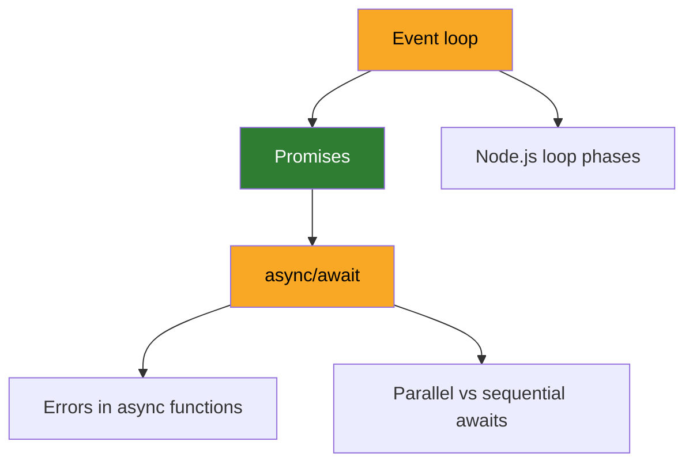
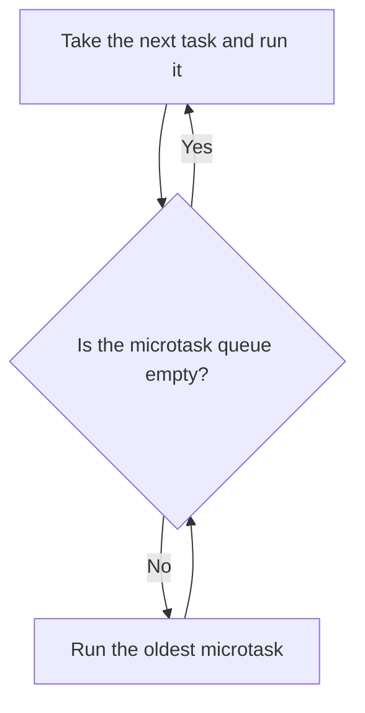

# Example: one course after its first session

One course for a learner who said "I want to understand async JavaScript properly".
Copy the shape and the depth, never the content.

---

## `COURSE.md`

```markdown
# Concurrency in JavaScript

**Why:** debug the hangs in the payments backend without guessing.
**How to explain it to me:** example first, theory after. No restaurant metaphors.
**Out of scope:** workers, streams.
```

"Understand async properly" was the opening answer, pushed until it named something the learner will be able to do.

---

## `MAP.md`

````markdown
## Map



## Evidence
- **Event loop**: could not say why a `.then()` runs before a `setTimeout(0)` queued earlier. Guessed "timers are faster".
- **Promises**: explained unprompted that chaining returns a new promise, and that a `.then()` handler's return value becomes the next one's input.
- **async/await**: said `await` "pauses the thread". Corrected in session 1, not yet re-probed.

## Sources
- [Jake Archibald, "In The Loop"](https://www.youtube.com/watch?v=cCOL7MC4Pl0): the real ordering of the two queues.
- [MDN, Using promises](https://developer.mozilla.org/en-US/docs/Web/JavaScript/Guide/Using_promises): reference for chaining and error propagation.
````

The learner is solid on `Promises` but weak on `Event loop`, which sits above it.
A triage that walked a straight line from easy to hard would have stopped at the first miss and never found that promises were held.
Both `Event loop` and `async/await` are weak, and the frontier is `Event loop`, because every other node depends on it.

---

## `lessons/0001-event-loop.md`

````markdown
# Event loop

Sometimes a request to the payments backend waits for seconds, and nothing in the logs says why.
To find the cause, you need to know the order in which JavaScript runs the code that is waiting.
That order is the event loop.
It has no parent on your map, but you already hold promises, so the examples use them.
After this lesson you can read async code and say which callback runs first, and why.

## Example

Run this file with `node`:

```js
console.log("script start");

setTimeout(() => console.log("timeout"), 0);

Promise.resolve()
  .then(() => console.log("then 1"))
  .then(() => console.log("then 2"));

console.log("script end");
```

The output, every time, in Node and in every modern browser:

```text
script start
script end
then 1
then 2
timeout
```

The timer was set first, with a delay of 0, and it still runs last.
Step by step:

1. `console.log("script start")` runs.
   Output: `script start`.
2. `setTimeout` does not run its callback.
   It asks for the callback to go into the task queue once the delay has passed.
3. `Promise.resolve()` gives a promise that is already resolved, so the first `.then()` callback goes straight into the microtask queue.
   The second `.then()` waits on the promise that the first `.then()` returned, so it is not in any queue yet.
4. `console.log("script end")` runs.
   Output: `script end`.
5. The script is done, and nothing else is running.
   Before the loop takes anything from the task queue, it empties the microtask queue.
   `then 1` runs.
   When it returns, the promise from the first `.then()` resolves, and that puts `then 2` in the microtask queue.
   The queue is not empty yet, so `then 2` runs too.
6. The microtask queue is now empty.
   Only now does the loop take the next task, the timer callback.
   Output: `timeout`.

## The idea

JavaScript runs one piece of code at a time, on one thread.
Code that has to run later waits in one of two queues.
The loop always empties the microtask queue completely before it takes one task from the task queue.
A promise callback is a microtask, and a timer callback is a task.
So a promise callback that is ready never waits behind a timer.

## How it works

Four terms carry the whole mechanism.

- **Call stack**: the code that is running now.
  The loop waits while there is code on the stack.
- **Task**: one unit of work in the task queue.
  Running the script is the first task.
  Timer callbacks from `setTimeout` and `setInterval` are tasks, and so are I/O callbacks, such as the one that handles an incoming request.
- **Microtask**: a callback that runs as soon as the stack is empty, before the next task.
  Promise callbacks (`.then`, `.catch`, `.finally`), the code after an `await`, and `queueMicrotask` callbacks are microtasks.
- **Microtask checkpoint**: the moment the loop empties the microtask queue.
  It starts each time the stack becomes empty.
  It ends only when the queue is empty, and that includes the microtasks added during the checkpoint.

In the example, step 5 is a microtask checkpoint.
`then 2` was added during it, and it still ran before the timer, because the checkpoint ended only when the queue was empty.

The same rule explains a hang.
If each microtask adds another microtask, the checkpoint never ends:

```js
function spin() {
  Promise.resolve().then(spin); // every run adds one more microtask
}
spin();
setTimeout(() => console.log("never printed"), 0);
```

This program prints nothing, never exits, and keeps the CPU busy.
The loop never gets back to the task queue, so no timer fires and no request is handled.
From the outside, the backend looks hung: requests wait, and nothing is logged.

Node.js keeps this rule and adds more structure: phases for different kinds of task, and a `process.nextTick` queue that runs even before promise callbacks.
That is the next node on your map, `Node.js loop phases`.

## Diagram



Start at the top: the script is the first task.
The cycle between the question and the box below it is the microtask checkpoint, and the only way back to the top is the Yes arrow.

## Common mistakes

- **"Timers are faster"**: that was your answer before this lesson.
  A timer's delay is the least time before its callback may run, not the time it runs.
  When the delay has passed, the callback is one more task in the queue, and every waiting microtask still goes first.
- **"`setTimeout(fn, 0)` runs `fn` right away"**: it puts `fn` in the task queue.
  The current script and the whole microtask queue always finish before it.
- **"Promise callbacks run in the background"**: nothing runs in the background.
  Every callback runs on the same thread, and while one runs, no request is handled.
  A long `.then` chain delays every task behind it, and a chain that never ends stops them all.

## Summary

- JavaScript runs one callback at a time, on one thread.
- After every task, the loop empties the microtask queue before it takes the next task.
- Promise callbacks and the code after `await` are microtasks, and timer and I/O callbacks are tasks.
- A timer's delay is a minimum wait, not a place at the front of the queue.
- A microtask that keeps adding microtasks stops every timer and every request, which looks like a hang.

## Visual

[The two queues draining, one callback at a time](0001-event-loop.html)

## Sources

- [Jake Archibald, "Tasks, microtasks, queues and schedules"](https://jakearchibald.com/2015/tasks-microtasks-queues-and-schedules/): the same kind of example, stepped through with the queues drawn at each step.
  Read the opening section and "Why this happens".
- [MDN, "Using microtasks in JavaScript with queueMicrotask()"](https://developer.mozilla.org/en-US/docs/Web/API/HTML_DOM_API/Microtask_guide): the rule that the loop keeps running microtasks until none are left, even while new ones are added.
  Section "Tasks vs. microtasks".
- [Node.js, "The Node.js Event Loop"](https://nodejs.org/en/learn/asynchronous-work/event-loop-timers-and-nexttick): the loop in Node, where the payments backend runs.
  Read "Phases Overview" for now.
  The rest is the next node.

## Check

**Two timers, and a promise inside the first one. What is the output, and why?**

```js
setTimeout(() => {
  console.log("timeout 1");
  Promise.resolve().then(() => console.log("then inside timeout 1"));
}, 0);

setTimeout(() => console.log("timeout 2"), 0);
```

Learner answered: `timeout 1`, `then inside timeout 1`, `timeout 2`.
"The first timer is a task. When it ends the stack is empty, so the microtask runs before the loop takes the second timer."
Correct, and the reason was the mechanism, not a memorised order.

## Result

Event loop: solid. Predicted a case the lesson never showed, and gave the mechanism behind it.
````

Why it reads this way:

- `## Example` comes before `## The idea`, because `COURSE.md` asks for the example first.
- `## Common mistakes` opens with "timers are faster", the learner's own answer recorded in `MAP.md`.
- All three programs were run, and the output shown is the output they gave.
- The check predicts a case the lesson never showed, a microtask inside a task, so it measures understanding and not reading.
- The page exists because the loop moves: it steps the example's callbacks through the two queues. `Promises` would get no page, because a rule about return values is what prose does well.

---

## After the session

In the graph, `class A,D weak` becomes `class D weak`, and `class B solid` becomes `class A,B solid`.
The `Event loop` evidence line is replaced by what the learner produced today.
`COURSE.md` does not change.
The next session teaches `async/await` before `Node.js loop phases`, although both are unblocked, because it carries a recorded wrong belief that would spread to `E` and `F`.
